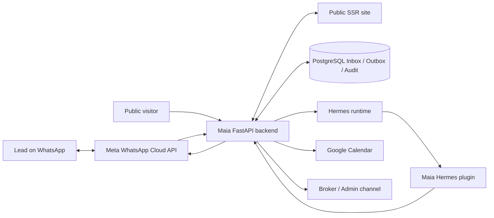
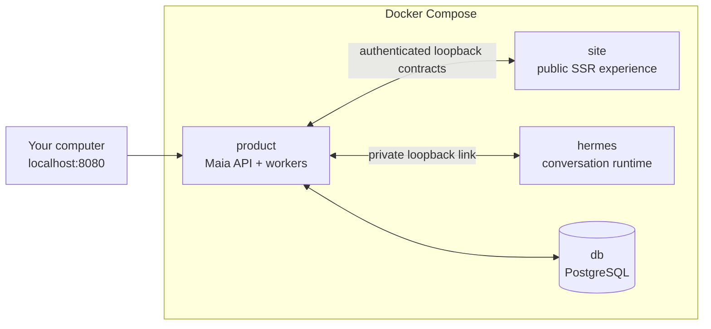

# Maia

Maia is a Hermes-backed real estate lead agent that handles WhatsApp inquiries,
answers from approved property documents, schedules visits through Google
Calendar, and runs deterministic follow-up workflows from an auditable product
backend.

This repository is intentionally public. It is written to show the engineering
work behind an agentic product, not just a chatbot demo: the language model
handles conversation and tool choice, while the backend owns identity,
authorization, persistence, delivery, retries, and business authority.

## What This Demonstrates

- A real product boundary around an LLM agent instead of a scripted intent
  classifier.
- WhatsApp webhook ingestion with signature validation, durable Inbox/Outbox,
  delivery retries, and ambiguity handling.
- Grounded property Q&A from accepted, versioned property documents.
- Appointment scheduling against Google Calendar availability.
- Telegram-based administrative workflows for exceptional cases.
- One eligibility gate above the Outbox, so no outbound message can exist
  without a recorded decision authorising it.
- A commercial system of record — Contacts, needs, Opportunities, assignment and
  next actions — behind small module interfaces, with the races that matter
  guarded by database constraints rather than service-layer checks.
- An explicit handling authority over each conversation, so an advisor and the
  agent can never answer the same customer at once, and a request for a human
  cannot quietly go unanswered.
- Appointments that belong to a named advisor and their own authoritative
  calendar, with rescheduling that secures the new time before releasing the old.
- Server-rendered Mexican Spanish operator surfaces for the team, absences,
  property specialists, the visit calendar and the conversation inbox, showing
  refused outbound decisions and communication restrictions with their reasons.
- A separate server-rendered public site for authorized inventory, explicit
  search, responsive galleries, saved collections, anonymous Maia conversations,
  and opaque continuity into the official WhatsApp channel.
- A read-only external-inventory port with an EasyBroker adapter, strict local
  service-area filtering, provenance-bearing candidates, and use-time
  revalidation that never replaces the authoritative Product catalog.
- Explainable, Administrator-reviewed reactivation and Development-campaign
  planning with explicit audiences, provider-observed templates, delivery-time
  consent and stop checks, and real dispatch disabled by default.
- A versioned domain-event taxonomy behind a durable analytics Outbox, projected
  into a separate pseudonymous PostgreSQL schema by a pass that is safe to replay
  and rebuilds a period rather than incrementing a counter, so a late event is
  correct instead of lost.
- Business intelligence that treats not knowing as reportable: `Sin registrar` is
  never a zero and never a loss, a ratio with no denominator says so, and invalid
  traffic is stored, classified and reported as excluded volume.
- A manually administered `Patrocinada` offer where payment buys a labelled
  position and provably not relevance — the module that orders public results
  imports nothing from the modules that handle money — with caps, deficit-based
  rotation, capacity that cannot be oversold, and paused days that are preserved
  rather than spent.
- A price catalog that refuses to publish a first price without a written
  reference to measured pilot traffic, seven-day quotes that preserve their
  catalog version, and discounts that require a recorded reason.
- Buyer reporting delivered by expiring, revocable, read-only link and an
  exportable PDF, carrying aggregate delivery, disclosed comparables and explicitly
  non-causal language — and no contact identity, phone number or conversation.
- A standalone Hermes plugin that exposes typed product operations without
  giving the agent direct database or Calendar credentials.
- Recovery-oriented tests around persistence, sessions, tools, workers,
  webhooks, and channel clients.

## Architecture

Maia has three deliberately separated runtime responsibilities:

- **Hermes runtime:** owns natural-language reasoning, conversation continuity,
  fragmented-message interpretation, tool selection, and response composition.
- **Maia backend:** owns trusted identity, PostgreSQL state, authorization,
  policy, idempotency, audit events, Calendar/Meta effects, and deterministic
  safety outcomes.
- **Public site:** owns server-rendered presentation and browser interaction; it
  consumes authenticated Product contracts and owns no catalog truth or identity.



The model is never trusted as the system of record. It can request operations
through tools; the backend decides what is allowed, records what happened, and
classifies uncertain outcomes for review.

## Current Status

Maia is a local product prototype. The core product paths are implemented and
test-covered locally:

- property document ingestion and replacement;
- grounded sales conversations through Hermes;
- WhatsApp webhook and outbound delivery workflow, gated on one recorded
  eligibility decision per message;
- appointment availability, booking, cancellation, and broker notifications;
- Telegram administration;
- an operational CRM: one brokerage organization, administrator and advisor
  roles, contacts, needs with confirmed and pending criteria, opportunities with
  explicit stages and evidence-bearing outcomes, deterministic assignment, and
  next actions;
- conversation-content expiry kept separate from commercial history;
- a Mexican Spanish public experience with indexable authorized listings,
  shareable search URLs, gallery and technical-sheet views, server-backed saved
  collections, anonymous Maia conversation, and single-use channel handoffs;
- fixture-backed EasyBroker candidate indexing and Product/Hermes search within
  Guadalajara, Zapopan, and Tlaquepaque, with Admin evidence controls and
  fail-closed recommendation/share/appointment revalidation;
- a Mexican-Spanish reactivation surface with explainable inventory matches,
  PII-safe campaign previews, bounded execution and auditable outcomes, while
  real Marketing dispatch remains `Denied` pending accepted external gates;
- versioned, idempotent analytics events, a durable analytics Outbox, a
  replayable projection into a separate pseudonymous schema, and an internal
  Mexican-Spanish BI dashboard reporting Follow-up Coverage, response time,
  qualification, attendance, outcome completeness, harm signals and invalid
  traffic — with `Sin registrar` kept distinct from zero;
- a manually administered sponsorship lifecycle with a versioned price catalog,
  seven-day quotes, capacity that cannot be oversold, labelled placements that
  never influence organic ordering, and expiring read-only buyer reports with an
  exportable PDF;
- Docker Compose packaging for a single-host local topology.

Not claimed yet:

- production deployment;
- multi-tenant operation;
- paid lead acquisition;
- a first sponsorship price, which stays unset until the pilot supplies the
  traffic data that would justify it;
- a data warehouse, ad auctions, pay-per-click billing, invoicing, or any
  movement of money;
- an agreed analytics retention period, which remains an explicit privacy and
  legal decision;
- proactive follow-up delivery, which stays refused until real consent capture
  and approved WhatsApp templates exist;
- legal/privacy readiness for real customer data;
- a real EasyBroker account, API MLS entitlement, collaborator authority, or
  provider-approved cache/redistribution rights;
- horizontal scaling or managed cloud operations.

## Run Maia

The complete local system runs in four Docker containers:



Hermes, Product, and the public Site are separate containers that share a private
network namespace. Product is the only host-published process: it serves its API
and proxies approved public paths to Site. Site calls Product through a dedicated
authenticated loopback contract and has no database access. PostgreSQL is reached
as `db` on the private Compose network. Site, Hermes, and PostgreSQL are not
exposed to the host.

Prerequisite: Docker with Docker Compose.

There are intentionally no bootstrap or startup wrapper scripts. Compose now
owns the service topology, dependency installation, startup order, health
checks, migrations, persistent volumes, and shutdown. A wrapper such as
`scripts/up.sh` would only hide the Compose command and create a second runtime
path that could drift from this file.

Create the one local environment file:

```bash
cp .env.example .env
```

In `.env`, fill the three shared local secrets with different values from
`openssl rand -hex 32`, then configure at least one local Basic-auth account:

```text
HERMES_DASHBOARD_SESSION_TOKEN=
PLUGIN_API_TOKEN=
SITE_PRODUCT_API_TOKEN=
DEVELOPER_BASIC_CREDENTIALS_JSON={"developer":"replace-with-a-secret"}
```

Add `ANTHROPIC_API_KEY` when you want real model conversations. Meta, Telegram,
and Google Calendar credentials are optional; their health status is reported
individually when absent. Google Calendar is the one exception to “one file”:
Google issues a service-account JSON key, so place it at
`secrets/google-calendar.json` and set the documented container path in `.env`.

Build the images and start everything the first time, or after dependencies or
Dockerfiles change:

```bash
docker compose up --build
```

For normal day-to-day startup, this is the only command:

```bash
docker compose up
```

The public experience is available at [http://localhost:8080/](http://localhost:8080/)
and Product health at [http://localhost:8080/health](http://localhost:8080/health).
Database migrations run automatically before Product starts.

Common operations:

```bash
docker compose down                 # stop; preserve data
docker compose logs -f              # follow every service
docker compose exec product pytest  # run the token-free test suite in Docker
```

The required CI gate runs without Meta, Anthropic, Google, or Telegram
credentials. See [Testing Maia without provider credentials](docs/testing.md)
for the exact coverage, commands, and optional live-provider layer. See the
[Stage 0 release checklist](docs/stage-0-release-checklist.md) for the final
local acceptance and recovery rehearsal, and [repository governance](docs/repository-governance.md)
for the branch and protection strategy. The [Stage 5 public-site guide](docs/public-site.md)
documents its routes, authority contracts, privacy boundary, visual system, and
manual acceptance path. The [Stage 6 external-inventory guide](docs/external-inventory.md)
documents the EasyBroker adapter boundary, mapping, revalidation, cleanup, test
levels, and activation gates. The [Stage 7 engagement guide](docs/reactivation-campaigns.md)
documents reviewed reactivation, explicit Development audiences, consent and
template evidence, execution limits, and why real dispatch remains denied. The
[Stage 8 BI and sponsorship guide](docs/bi-and-sponsorship.md) documents the event
dictionary, the versioned measurement definitions and their exact borders, the
projection and its invalid-traffic reporting, the privacy boundary, the paid
delivery rules, pricing and quoting, the two report audiences, and the commercial
decisions that remain open.
