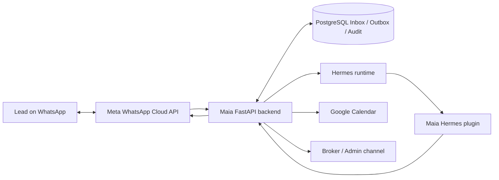

# Maia

Maia is a Hermes-backed real estate lead agent that handles WhatsApp inquiries,
answers from approved property documents, schedules visits through Google
Calendar, and runs deterministic follow-up workflows from an auditable product
backend.

This repository is intentionally public. It is written to show the engineering
work behind an agentic product, not just a chatbot demo: the language model
handles conversation and tool choice, while the backend owns identity,
authorization, persistence, delivery, retries, and business authority.

## What This Demonstrates

- A real product boundary around an LLM agent instead of a scripted intent
  classifier.
- WhatsApp webhook ingestion with signature validation, durable Inbox/Outbox,
  delivery retries, and ambiguity handling.
- Grounded property Q&A from accepted, versioned property documents.
- Appointment scheduling against Google Calendar availability.
- Telegram-based administrative workflows for exceptional cases.
- Deterministic 28-day follow-up cadence for Facebook/WhatsApp leads.
- A standalone Hermes plugin that exposes typed product operations without
  giving the agent direct database or Calendar credentials.
- Recovery-oriented tests around persistence, sessions, tools, workers,
  webhooks, and channel clients.

## Architecture

Maia has two deliberately separate parts:

- **Hermes runtime:** owns natural-language reasoning, conversation continuity,
  fragmented-message interpretation, tool selection, and response composition.
- **Maia backend:** owns trusted identity, PostgreSQL state, authorization,
  policy, idempotency, audit events, Calendar/Meta effects, and deterministic
  safety outcomes.



The model is never trusted as the system of record. It can request operations
through tools; the backend decides what is allowed, records what happened, and
classifies uncertain outcomes for review.

## Current Status

Maia is a local Stage 0 product prototype. The core product paths are
implemented and test-covered locally:

- property document ingestion and replacement;
- grounded sales conversations through Hermes;
- WhatsApp webhook and outbound delivery workflow;
- appointment availability, booking, cancellation, and broker notifications;
- Telegram administration;
- follow-up scheduling and durable worker processing;
- Docker Compose packaging for a single-host local topology.

Not claimed yet:

- production deployment;
- multi-tenant operation;
- CRM integration;
- paid lead acquisition;
- legal/privacy readiness for real customer data;
- horizontal scaling or managed cloud operations.

## Repository Layout

```text
src/realestate/       FastAPI backend, domain logic, workers, channels, Hermes client
plugin/               Standalone Hermes plugin exposing Maia tools
roles/                Source prompts for Hermes sales/admin profiles
tests/                Offline and integration-oriented pytest suite
migrations/           Alembic migrations for PostgreSQL product state
docs/                 Public architecture notes and repository governance
scripts/              Local bootstrap and run helpers
docker/               Product and Hermes container definitions
```

## Local Development

Prerequisites:

- Python 3.12
- Docker
- `uv`
- a sibling Hermes checkout, by default at `~/workspace/repos/hermes-agent`

Bootstrap:

```bash
scripts/bootstrap.sh
```

Start the local topology:

```bash
scripts/up.sh
```

Run tests:

```bash
source .venv/bin/activate
PYTHONPATH=. pytest
```

Some tests skip unless PostgreSQL, the product app, or `hermes serve` are
running. The offline suite is designed to run on a cold machine; full
checkpoint confidence requires the local topology and configured provider keys.

## Public Repo Policy

This repo is public-facing by design. Keep implementation evidence visible, but
do not commit private operating notes, raw Codex memories, local Hermes runtime
state, real leads, credentials, tokens, transcripts, or property documents that
were not created for public demonstration.

The curated project memory for future agents lives in `PROJECT_MEMORY.md`.
Private working notes should live outside pushed public branches: use ignored
local notes, local-only branches, or a separate private repository.

See `docs/repository-governance.md` for the branch and protection strategy.

## Recruiter Notes

Maia is useful to review as backend/platform work around AI agents:

- it separates agent reasoning from deterministic authority;
- it uses typed tools and auditable state instead of letting the model mutate
  business systems directly;
- it treats delivery, retries, identity, credentials, and operational recovery
  as first-class product concerns;
- it shows practical integration work across FastAPI, PostgreSQL, Alembic,
  Docker, WhatsApp, Telegram, Google Calendar, and a Hermes plugin boundary.
