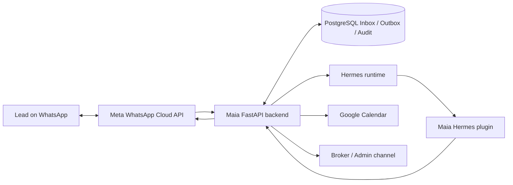
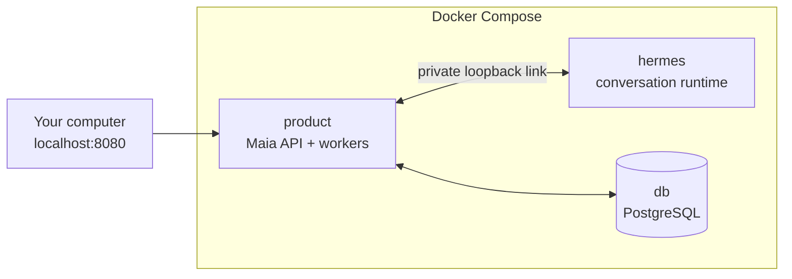

# Maia

Maia is a Hermes-backed real estate lead agent that handles WhatsApp inquiries,
answers from approved property documents, schedules visits through Google
Calendar, and runs deterministic follow-up workflows from an auditable product
backend.

This repository is intentionally public. It is written to show the engineering
work behind an agentic product, not just a chatbot demo: the language model
handles conversation and tool choice, while the backend owns identity,
authorization, persistence, delivery, retries, and business authority.

## What This Demonstrates

- A real product boundary around an LLM agent instead of a scripted intent
  classifier.
- WhatsApp webhook ingestion with signature validation, durable Inbox/Outbox,
  delivery retries, and ambiguity handling.
- Grounded property Q&A from accepted, versioned property documents.
- Appointment scheduling against Google Calendar availability.
- Telegram-based administrative workflows for exceptional cases.
- Deterministic 28-day follow-up cadence for Facebook/WhatsApp leads.
- A standalone Hermes plugin that exposes typed product operations without
  giving the agent direct database or Calendar credentials.
- Recovery-oriented tests around persistence, sessions, tools, workers,
  webhooks, and channel clients.

## Architecture

Maia has two deliberately separate parts:

- **Hermes runtime:** owns natural-language reasoning, conversation continuity,
  fragmented-message interpretation, tool selection, and response composition.
- **Maia backend:** owns trusted identity, PostgreSQL state, authorization,
  policy, idempotency, audit events, Calendar/Meta effects, and deterministic
  safety outcomes.



The model is never trusted as the system of record. It can request operations
through tools; the backend decides what is allowed, records what happened, and
classifies uncertain outcomes for review.

## Current Status

Maia is a local Stage 0 product prototype. The core product paths are
implemented and test-covered locally:

- property document ingestion and replacement;
- grounded sales conversations through Hermes;
- WhatsApp webhook and outbound delivery workflow;
- appointment availability, booking, cancellation, and broker notifications;
- Telegram administration;
- follow-up scheduling and durable worker processing;
- Docker Compose packaging for a single-host local topology.

Not claimed yet:

- production deployment;
- multi-tenant operation;
- CRM integration;
- paid lead acquisition;
- legal/privacy readiness for real customer data;
- horizontal scaling or managed cloud operations.

## Run Maia

The complete local system runs in three Docker containers:



Hermes and Product are separate containers, but they share a private network
namespace. This is intentional: Hermes accepts Maia's session-token protocol
only over loopback. PostgreSQL is a normal third container reached as `db` on
the private Compose network. Hermes and PostgreSQL are not exposed to the host.

Prerequisite: Docker with Docker Compose.

There are intentionally no bootstrap or startup wrapper scripts. Compose now
owns the service topology, dependency installation, startup order, health
checks, migrations, persistent volumes, and shutdown. A wrapper such as
`scripts/up.sh` would only hide the Compose command and create a second runtime
path that could drift from this file.

Create the one local environment file:

```bash
cp .env.example .env
```

In `.env`, fill these three required local secrets with different values from
`openssl rand -hex 32`:

```text
HERMES_DASHBOARD_SESSION_TOKEN=
PLUGIN_API_TOKEN=
DEVELOPER_BASIC_PASSWORD=
```

Add `ANTHROPIC_API_KEY` when you want real model conversations. Meta, Telegram,
and Google Calendar credentials are optional; their health status is reported
individually when absent. Google Calendar is the one exception to “one file”:
Google issues a service-account JSON key, so place it at
`secrets/google-calendar.json` and set the documented container path in `.env`.

Build the images and start everything the first time, or after dependencies or
Dockerfiles change:

```bash
docker compose up --build
```

For normal day-to-day startup, this is the only command:

```bash
docker compose up
```

Maia is available at
[http://localhost:8080/health](http://localhost:8080/health). Database
migrations run automatically before Product starts.

Common operations:

```bash
docker compose down                 # stop; preserve data
docker compose logs -f              # follow every service
docker compose exec product pytest  # run the complete test suite in Docker
```

Do not create local Python virtual environments to run Maia. The images contain
the Product and Hermes dependencies. The Hermes image fetches the exact reviewed
upstream commit pinned in `docker/hermes.Dockerfile`; a sibling Hermes checkout
is not required.

## Repository Layout

```text
src/realestate/       FastAPI backend, domain logic, workers, channels, Hermes client
plugin/               Standalone Hermes plugin exposing Maia tools
roles/                Source prompts for Hermes sales/admin profiles
tests/                Offline and integration-oriented pytest suite
migrations/           Alembic migrations for PostgreSQL product state
docs/                 Public architecture notes and repository governance
docker/               Product and Hermes container definitions
```

## Public Repo Policy

This repo is public-facing by design. Keep implementation evidence visible, but
do not commit private operating notes, raw Codex memories, local Hermes runtime
state, real leads, credentials, tokens, transcripts, or property documents that
were not created for public demonstration.

The curated project memory for future agents lives in `PROJECT_MEMORY.md`.
Private working notes should live outside pushed public branches: use ignored
local notes, local-only branches, or a separate private repository.

See `docs/repository-governance.md` for the branch and protection strategy.

## Recruiter Notes

Maia is useful to review as backend/platform work around AI agents:

- it separates agent reasoning from deterministic authority;
- it uses typed tools and auditable state instead of letting the model mutate
  business systems directly;
- it treats delivery, retries, identity, credentials, and operational recovery
  as first-class product concerns;
- it shows practical integration work across FastAPI, PostgreSQL, Alembic,
  Docker, WhatsApp, Telegram, Google Calendar, and a Hermes plugin boundary.
