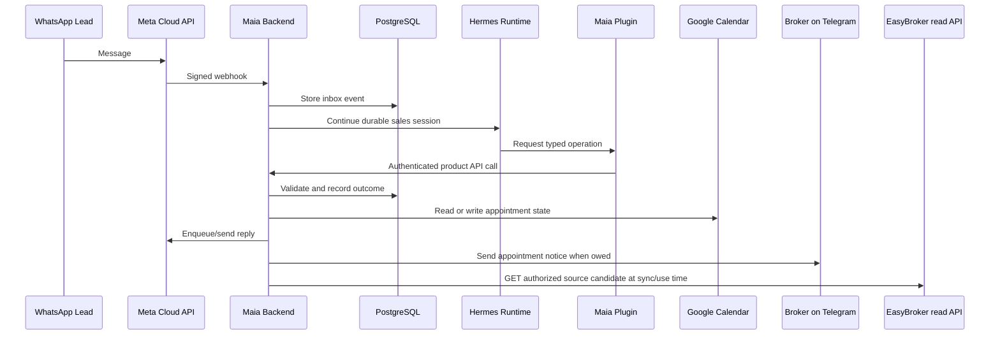

# Maia Architecture

Maia is built around a strict split between conversational intelligence and
business authority.

## Runtime Split

Hermes is the conversational runtime. It receives the lead-facing context,
maintains sessions, interprets fragmented WhatsApp messages, and decides which
tool to call.

The Maia backend is the product authority. It receives webhooks, persists state,
checks policy, owns idempotency, calls external systems, and records audit
events.

The customer channel is WhatsApp. Telegram is not the customer entry point: it
is the private Broker/Administrator channel. Its inbound administrative role is
an additional operator surface, while its outbound notices are Product-owned
effects caused by appointment state (immediate booking or review notice,
morning digest, and pre-visit reminder). Hermes composes the natural customer
conversation; Maia decides when a Telegram notice is owed and performs the
send.

## Why the Model Is Not the Authority

The model can be good at conversation and still be the wrong place for business
truth. Maia keeps the risky operations below the model:

- the backend chooses whether a property exists and is active;
- the backend decides whether a slot can be booked;
- the backend records every accepted operation;
- the backend handles duplicate webhooks and retries;
- the backend classifies uncertain delivery or Calendar outcomes for review.

This allows natural conversation without giving the model unchecked access to
database credentials, Calendar credentials, or WhatsApp delivery state.

One consequence is a freshness rule. A property document or status can change
while a durable session stays open, so a turn that repeats a property fact must
re-read it through `get_property_information` rather than reuse a fact retrieved
earlier in the same conversation. Product restates that contract on every Sales
turn, because an instruction given only once loses salience behind facts the
model already has. This reverses an earlier position that revalidating before
every ordinary reply was unnecessary; the cost is one extra tool call on turns
that discuss a property.

## The Commercial System of Record

Product owns the commercial truth beneath the conversation: who the person is,
what they want, who is responsible, what is owed, and how it ended. Those live in
`domain/commercial/` as deep modules — a small interface over the transactions,
invariants, idempotency and audit the capability actually needs — and the
routers, workers and templates above them hold none of those rules.

| Seam | The only way to |
|---|---|
| `CommercialIdentity.resolve` | turn a channel identity into a Contact |
| `PropertyNeeds` | record what the Contact wants, and how confirmed it is |
| `OpportunityManagement.record` | open an Opportunity or change its stage |
| `Assignment.assign` | decide who is responsible, or make the absence visible |
| `NextActions.schedule` / `.complete` | owe and discharge the next action |
| `CommercialInbox.query` | read anything an operator surface shows |
| `CommercialIntake.record_inbound` | cross from the WhatsApp Inbox into commercial work |
| `ConversationRetention` / `CommercialMaintenance` | apply the rules that are about time |
| `OrganizationDirectory` | resolve the Organization and who belongs to it |
| `TeamAdministration.record` | add a member, declare an absence, designate a Property Expert |
| `ConversationHandling.take` / `.release` / `.reply` | decide who answers a Contact, and answer as a human |
| `HumanHandoff.request` / `.acknowledge` | record an unmet request for a person, and its deadline |
| `AdvisorScheduling.find_slots` | ask what times an Advisor could actually receive a visit |
| `Appointments.book` / `.reschedule` / `.cancel` / `.record_outcome` | change a visit and record what happened at it |
| `InternalAlerts.raise_alert` | tell somebody in the operation, durably |
| `ExternalInventory.search` / `.refresh` | index and read source candidates without creating authoritative Listings |
| `ListingRevalidation.evaluate` | decide whether one fresh external candidate may be recommended, shared, or scheduled |
| `InventorySourceHealth.read` | expose sanitized source health without credentials |
| `InventoryMatching.propose` | explain whether authorized inventory matches confirmed demand |
| `TemplateRegistry.synchronize` / `.approved` | observe provider truth without local template approval |
| `Reactivation.discover` / `.authorize` | propose a reviewed Listing match without sending it |
| `Campaigns.plan` / `.activate` / `.pause` / `.cancel` | control an explicit, bounded Development audience |
| `Audience.resolve` | apply the same exclusions to dry-run and execution |

Four separations are structural rather than conventional, each enforced by the
schema:

- an **Organization** owns commercial data, so nothing is implicitly global;
- a **Contact** is a person across time, distinct from the channel identity Meta
  authenticates and from the Conversation they happen to be having;
- a **commercial stage** says where the pursuit stands and nothing else —
  assignment, appointments, consent and Do Not Contact are their own state;
- an **inferred criterion** is Pending until the Contact confirms it.

The races that matter are guarded by partial unique indexes, not by service-layer
checks: one open assignment per Opportunity, one Pending Next Action, one open
queue entry, one current value per named criterion, one open exception, one
default Advisor per Organization. Terminal outcomes are guarded by CHECK
constraints, so a conversational inference cannot satisfy them by accident.

Intake runs inside the transaction that persists the inbound message. A Contact
or an Opportunity that outlived the message which produced it would be a record
of something that never durably happened.

The time-driven rules are paced rather than polled. `CommercialMaintenance` knows
what they are; `CommercialUpkeepWorker` is the object that lives long enough to
remember when they last ran, and it holds them to a 15-minute interval. The
background loop ticks once a second and these rules have 28- and 90-day horizons,
so without the guard the pass would scan roughly 86,400 times a day to discover
there was nothing to do — the same reason the Broker notifier owns its own
cadence.

Stage 7 engagement is a Product workflow, not a Hermes campaign agent. Matching
is a pure, versioned comparison of authorized Listing facts against confirmed
Property Need criteria; it emits criterion-level explanations and refuses stale
needs. An Administrator may review a Candidate or an explicit Development
audience, but cannot create consent, approve a Meta template, override
suppression, or write an Outbox row.

Provider template observations are evidence with a 24-hour Product freshness
window. Only an exact Approved Marketing name, language and static body is
consumable. The engagement worker calls the existing outbound gate, which writes
the decision and Outbox row in the same transaction as the Candidate/audience
outcome. Immediately before Meta delivery, the gate rechecks consent scope,
suppression, reply and provider status, and locks the Candidate or Campaign so an
administrative pause/cancel establishes a causal no-new-delivery boundary.
Real execution remains disabled by configuration until the legal, consent,
provider and operational gates are explicitly accepted.

## Measurement and Paid Visibility

Stage 8 adds two things that had to arrive together, and one boundary that keeps
them apart.

Measurement is its own pipeline. `AnalyticsEvents.record` validates against a
closed, versioned taxonomy, replaces raw session and subject identifiers with
salted digests, and writes to `analytics.analytics_outbox` — a durable queue that
is deliberately *not* `outbox_messages`. A stuck measurement row must never share
a queue, a retry budget or a failure mode with a message a customer is waiting
for. `AnalyticsProjection.refresh` then consumes in sequence order, inserts
idempotently, and **recomputes** each period it touched rather than incrementing
it. That last choice is what makes the pass safe to re-run, safe to replay from
zero, and correct for a late event: an event arriving today for last Tuesday
rebuilds last Tuesday instead of landing on today or being dropped for being old.

Every threshold a reported number depends on is stored under a version in
`analytics.measurement_definitions`, not compiled in. Serving is Product's own
fact, recorded server-side as the response is built. Visibility is a browser
observation whose *threshold* Product applies, so a modified client cannot
manufacture a Visible Impression. Invalid traffic — bots, internal use, synthetic
fixtures, implausible rates — is stored, classified and reported as excluded
volume rather than deleted, because a metric that silently drops rows and one that
never had them look identical to the reader.

The analytics schema has no foreign key to a Contact and no attribute anywhere in
the taxonomy that free text would fit in. Session and subject references use
separate salts per purpose, so holding both tables does not let anybody confirm
that an anonymous session belongs to a known Contact.

Paid visibility sits on top of that measurement and touches nothing else.
`SponsoredEligibility` re-uses the same `PublicShare` decision the unpaid site
gets and adds only what money introduces: a written commercial clearance standing
in for the still-Pending SAN-065, one sponsored position per confirmed Property,
and the campaign's own state and remaining paid days. `SponsoredDelivery` returns
paid slots as their own list; the organic list arrives already ordered by
`PublicCatalog`, which imports nothing from sponsorship at all. That absence is
asserted by a test, because "payment does not influence relevance" is only
credible if the ranking code cannot reach the money code even by accident.

Two capacity ceilings are kept apart. The delivery ratio bounds what one page
shows; the sales ceiling bounds how many campaigns may hold a surface over the
same days. Respecting only the first is how a product sells twenty concurrent
campaigns and delivers each buyer a twentieth of what they expected. Reservations
are taken under a per-surface lock, and a paid day is consumed by being
*delivered* rather than by passing on a calendar — so a Listing withdrawn for a
week returns that week instead of producing an apology.

Reporting is one computation exposed at two audiences. Two implementations would
eventually disagree, and a buyer noticing that their report and the
Administrator's do not add up is not recoverable. The buyer's half travels by an
expiring, revocable, read-only link stored only as a digest, with a PDF built from
the same line list as the page.

## The Managed Platform

Stage 9 turns one brokerage's product into a service several brokerages are on,
and almost all of it is one property: **no operation reaches across
Organizations.** The mechanisms are in `domain/platform/`, and each of them exists
because the failure it prevents is silent.

The foundation is not a module — it is the schema. Every table holding a
Brokerage Organization's data names it in an `organization_id` column, with a
deferred composite foreign key so the column and its parent cannot disagree, and
every business key that was globally unique is unique per Organization instead.
`domain/platform/scoping.py` writes down which table is which, with a stated
reason for each of the four that are deliberately platform-wide, and three
independent mechanisms read that table rather than restating it: the export, the
deletion, and the isolation matrix. A table missing from it fails a test.

| Seam | The only way to |
|---|---|
| `OrganizationRouting.resolve` | decide which Organization an inbound number, bot or hostname belongs to — and refuse an unbound one |
| `OrganizationProvisioning.provision` / `.deprovision` | bring an Organization into existence, or take it out, resumably and reversibly |
| `OrganizationConfiguration.record` | state how an Organization operates, as a version somebody explained |
| `IntegrationCredentials.resolve` | reach a provider as one Organization, never as the platform and never as another |
| `Entitlements.evaluate` / `.require` | decide whether an Organization may do something, and say why not |
| `SupportAccess.grant` / `.revoke` | let an internal engineer read a customer's records, temporarily and visibly |
| `OrganizationImport.plan` / `.apply` / `.roll_back` | bring an Organization's existing records in, dry-run first |
| `OrganizationDataLifecycle.export` / `.delete` | hand over or remove everything an Organization owns |
| `PlatformUsage.refresh` / `.read` | count what the platform measures about an Organization |
| `operating_organizations` | ask which Organizations a background pass should act for |

Two authorities, deliberately of different *types* rather than two values of one
flag. An `Actor` is a caller inside one Organization and is what every commercial,
catalog, conversation and analytics surface takes. A `PlatformOperator` is an
internal operator of the service; it provisions, configures, entitles and
measures, and it is refused by every surface that reads a customer's records.
Neither can be constructed by a domain module — one comes from a member row, the
other from a dedicated credential plus a mandatory operator name.

That split is what replaces the superadmin. To read a customer's records an
internal engineer takes a support grant, which creates an *ordinary* read-only
member row inside one Organization — so every existing authorization check applies
unchanged, because there is no second code path with weaker rules — expiring
within eight hours, checked at login resolution rather than by a worker, and
listed on that Organization's own `/crm/plataforma` page with the reason on it.

Credentials are the other place the boundary has to hold, and there the failure
mode is a *success*: an Organization with no token of its own silently using the
platform's would send its messages from somebody else's number, into somebody
else's Meta account. So a credential is never inherited. Product stores a
*reference* — the name of the place the value lives — and resolution consults only
the asking Organization's own, with one bounded exception: the process environment
answers for the single founding Organization named in configuration, compared by
id, and for nobody else.

## Human Operation, Team and Visits

Stage 3 adds the part of the operation that has people in it. Three separations
carry it, and each one exists because conflating the two sides caused a specific
failure.

**Expert is not owner.** A Property Expert is a specialist for a Property; a
Responsible Advisor is accountable for one Opportunity. They live in different
tables and nothing in `TeamAdministration` writes `responsible_advisor_id`, so
designating a specialist cannot silently move work. The assignment rule reads
both: preserve an existing owner, else the Property's *present* expert, else its
backups by rank, else the configured default Advisor, else the Assignment Queue
with a reason the Administrator can act on.

**An absence blocks new work, never existing work.** A declared Advisor Absence
removes somebody from the assignment rule and from new bookings, and subtracts
from their availability like busy time. It does not reassign an Opportunity or
cancel a visit — and because "not reassigned" is only trustworthy if somebody is
told, recording one raises an internal alert naming exactly how much work it left
alone. A PostgreSQL exclusion constraint makes two overlapping live absences for
one Advisor impossible under concurrency.

**Handling authority is explicit and singular.** Conversation Handling Mode names
who may answer, and a human mode always names the person. The Lead worker reads
it when it claims a Conversation and again at settlement under the row's lock, so
a human arriving mid-turn wins and the draft is withheld rather than delivered
beside whatever the person is about to write. Two Advisors pressing *Atender*
resolve to one holder through the row lock and the unique index; the loser is
told who has it.

Visits gained an owner and an authoritative calendar (ADR-0048). Availability is
resolved through a calendar directory — one credential, one calendar id per
Advisor — and the distinction that matters is between *busy* and *unknown*: a
full calendar has no slots and that is an answer, while an unconfigured or
unreadable one is a refusal with its own reason. Booking persists the attempt
before touching Calendar, an inconclusive write becomes `NeedsReview`, and
rescheduling secures the successor before releasing the original so every failure
path leaves the original Confirmed.

Two Contact-facing behaviours are deliberately blocked rather than approximated.
Visit reminders are scheduled deterministically and withheld with a recorded
reason, because SAN-036 has not validated the cadence. And post-appointment
routing is a whitelist: a message is Maia's only if it clearly matches
Appointment Logistics or is a bare pleasantry, so ambiguity reaches the Advisor
as ADR-0037 requires.

Internal alerts are their own durable channel, not the Outbox (ADR-0049). That is
what makes the fifteen-minute human-handoff escalation exactly-once across a
restart: the alert row and the escalation stamp commit together, so the deadline
is stored rather than held in a timer.

## Operator Surfaces

`/crm` is server-rendered, Mexican Spanish, and needs no JavaScript: every action
is a form submission, so the surfaces stay usable on a slow phone and testable
without a browser. Authentication is the existing HTTP Basic credential;
authorization resolves it to an Organization member row (ADR-0046). Property
administration and document upload go through the same resolution and require the
Administrator role — before this cut they accepted any configured credential
without looking at a role at all.

Every mutating form carries a hidden idempotency key minted when the page was
rendered, so a double click, an impatient refresh or a retried request replays
the command the domain already recorded instead of repeating it. The shell,
including the table renderer that carries the caption and header scopes, is
shared with the Property surfaces so one screen cannot quietly lose the
accessibility guarantees the others are tested for.

The panel reports Follow-up Coverage with its gaps attached. The Inbox,
Opportunities, Contacts and Assignment Queue read exclusively through
`CommercialInbox`, which is also where Organization scoping, role visibility,
expired message bodies and communication restrictions are applied once.

Stage 3 adds Team, Absences, Specialists, the visit Calendar and the pending-work
list, in `api/operations.py`. They exist to make four things impossible to miss:
who is answering a conversation, who is responsible as opposed to who
specialises, which visit is actually Confirmed, and what has been waiting for a
human and for how long. An Advisor sees the same pages with the *forms* removed
rather than the information — knowing a colleague is away is how a human decides
whether to wait or escalate.

No control claims success before an authoritative confirmation. The reschedule
screen offers only starts the Advisor's own calendar returned a moment ago rather
than a free-text field, and a refusal renders as its named reason.

Denied outbound decisions and an active Do Not Contact are shown to the operator
with the reason. Showing them is the point — an operator who cannot see why a
message did not go out concludes the system is broken.

Stage 8 adds `/crm/bi` and `/crm/patrocinios`, both Administrator-only. The
data-quality panel is on the same page as the results deliberately: a coverage
number next to "42 percent of outcomes are unrecorded" is a number somebody will
question, and on a separate tab it is a number somebody will quote. The
sponsorship surface shows capacity next to the sale, so an Administrator selling a
fourth concurrent campaign sees the refusal coming rather than discovering it at
reservation — and while no price catalog is published it says the first price
requires pilot data instead of offering an empty field somebody would fill in.

The CRM does now send, and only through the same gate. An Advisor who holds a
Conversation may reply on the Brokerage Organization's own channel (ADR-0029),
and that message passes `OutboundMessaging.request` exactly as Maia's does:
suppression is a fact about the Contact and Meta's 24-hour window is a platform
constraint, neither of which becomes negotiable because a person typed it. Denied
replies are reported to the operator in terms of what to do next.

## Tool Boundary

The standalone Hermes plugin is deliberately thin. It exposes typed tools to
Hermes and calls Maia's product API with a local shared token. It does not
import the database layer and does not implement business rules.

That keeps the agent interface clear:

- Hermes sees stable tool contracts.
- Maia keeps deterministic policy.
- Tests can cover the product behavior without mocking the model.

## Current Local Topology

Docker Compose runs the topology as four containers:

- `db`: PostgreSQL and the durable Product state;
- `product`: FastAPI and the in-process background workers;
- `site`: the public server-rendered experience with no database or provider credential;
- `hermes`: the pinned Hermes runtime with the standalone Maia plugin.

Product, Site, and Hermes share a private network namespace so their authenticated
JSON-RPC WebSocket remains loopback-only. They are still separate processes and
containers. Product reaches PostgreSQL through the private Compose network.
Only Product port 8080 is published to the host.

Runtime configuration lives in one ignored `.env`. Docker volumes retain
PostgreSQL data, Hermes profile state, accepted Property Documents, Listing media
and per-Organization export artifacts. No local Python virtual environment or
sibling Hermes checkout is part of the operator workflow.

Since Stage 9 that `.env` describes exactly one Brokerage Organization — the
founding one, named by `PLATFORM_BOOTSTRAP_ORGANIZATION_SLUG` — and startup binds
its channels and names its existing credentials as references, idempotently,
without moving a secret. Every other Organization reads its own versioned
configuration and its own secret references, or is refused. Telegram workers
poll one verified bot per active Organization inside Product. The remaining
single-Organization topology limit is the `site` container, which serves one
public origin.

Optional integrations require their normal provider credentials:

- optional Meta, Telegram, Google Calendar, model-provider, and EasyBroker
  credentials. EasyBroker API MLS remains disabled until its separate plan and
  collaboration permissions are explicitly confirmed.

This is enough to prove product behavior and recovery paths before adding cloud
deployment, managed secrets, production WhatsApp assets, and real lead data.
