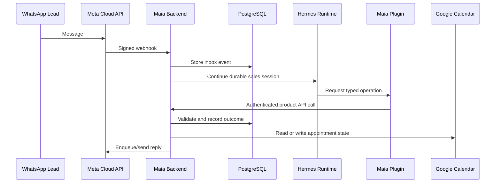

# Maia Architecture

Maia is built around a strict split between conversational intelligence and
business authority.

## Runtime Split

Hermes is the conversational runtime. It receives the lead-facing context,
maintains sessions, interprets fragmented WhatsApp messages, and decides which
tool to call.

The Maia backend is the product authority. It receives webhooks, persists state,
checks policy, owns idempotency, calls external systems, and records audit
events.

## Why the Model Is Not the Authority

The model can be good at conversation and still be the wrong place for business
truth. Maia keeps the risky operations below the model:

- the backend chooses whether a property exists and is active;
- the backend decides whether a slot can be booked;
- the backend records every accepted operation;
- the backend handles duplicate webhooks and retries;
- the backend classifies uncertain delivery or Calendar outcomes for review.

This allows natural conversation without giving the model unchecked access to
database credentials, Calendar credentials, or WhatsApp delivery state.

## Tool Boundary

The standalone Hermes plugin is deliberately thin. It exposes typed tools to
Hermes and calls Maia's product API with a local shared token. It does not
import the database layer and does not implement business rules.

That keeps the agent interface clear:

- Hermes sees stable tool contracts.
- Maia keeps deterministic policy.
- Tests can cover the product behavior without mocking the model.

## Current Local Topology

Docker Compose runs the Stage 0 topology as three containers:

- `db`: PostgreSQL and the durable Product state;
- `product`: FastAPI and the in-process background workers;
- `hermes`: the pinned Hermes runtime with the standalone Maia plugin.

Product and Hermes share a private network namespace so their authenticated
JSON-RPC WebSocket remains loopback-only. They are still separate processes and
containers. Product reaches PostgreSQL through the private Compose network.
Only Product port 8080 is published to the host.

Runtime configuration lives in one ignored `.env`. Docker volumes retain
PostgreSQL data, Hermes profile state, and accepted Property Documents. No
local Python virtual environment or sibling Hermes checkout is part of the
operator workflow.

Optional integrations require their normal provider credentials:

- optional Meta, Telegram, Google Calendar, and model-provider credentials.

This is enough to prove product behavior and recovery paths before adding cloud
deployment, managed secrets, production WhatsApp assets, and real lead data.
