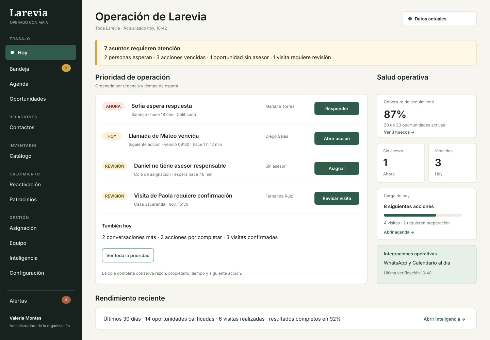
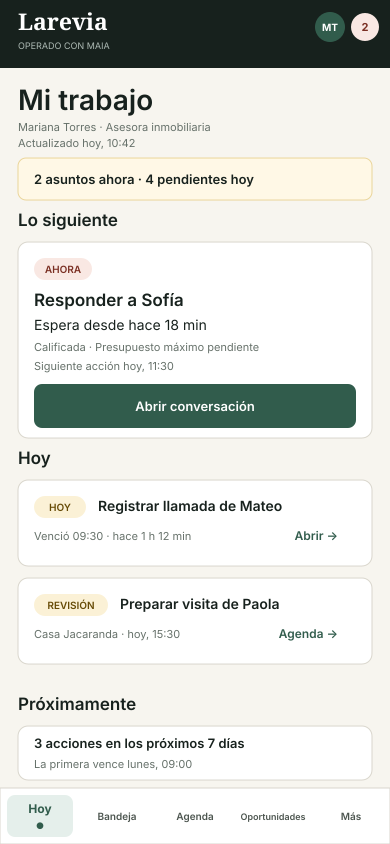
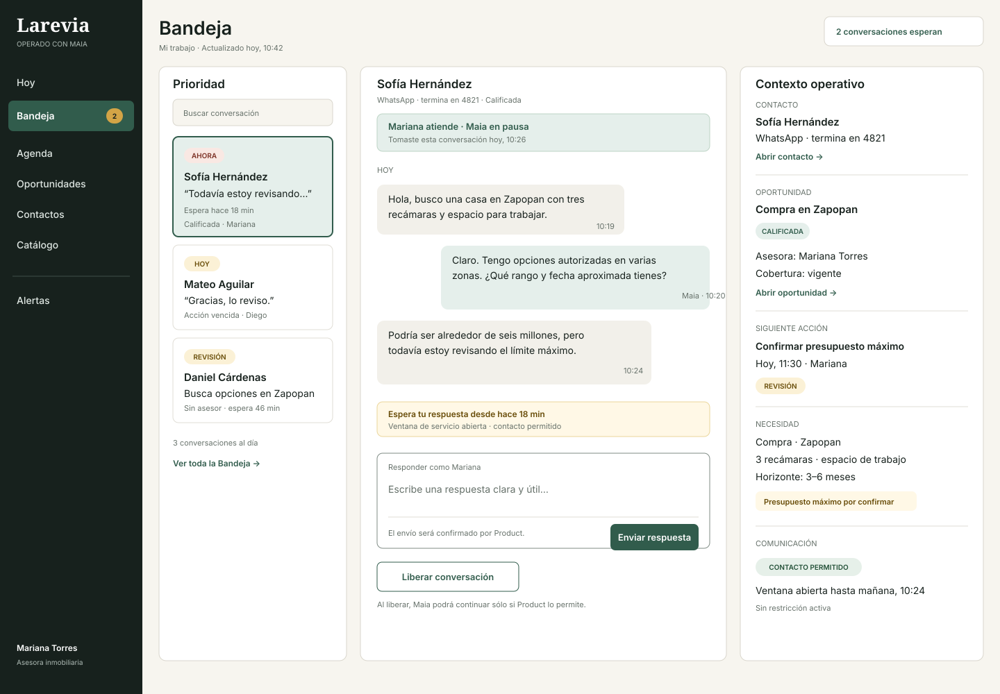
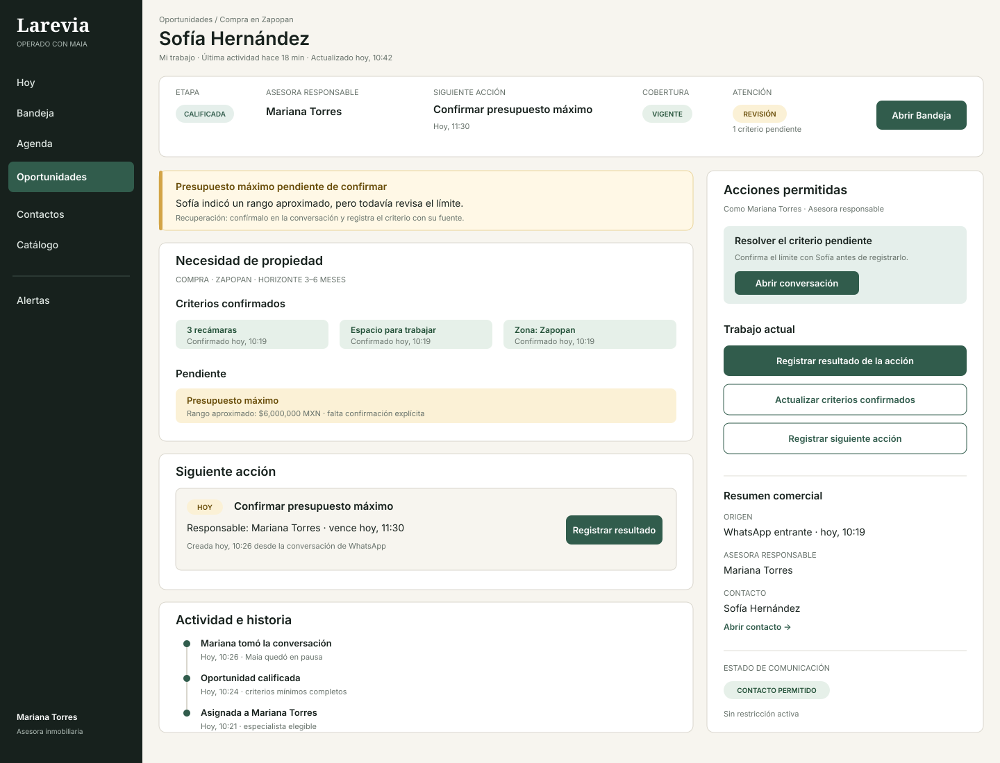

# CRM Reference Screens

These four screens make the contracts in [Maia CRM](crm.md) and
[CRM Design System](crm-design.md) concrete. They are static design references,
not application implementation or runtime fixtures.

The depicted information is one coherent, invented operational snapshot. The
rendered product surfaces intentionally contain no environment banner,
placeholder copy, or fictionality notice. This document holds the safety
boundary: none of the names, conversations, properties, appointments, amounts,
metrics, channel references, or operational states may be imported into Product
truth.

## Reference snapshot

- **Brokerage Organization:** Larevia
- **Snapshot:** 29 agosto 2026, 10:42 · America/Mexico_City
- **Administrator:** Valeria Montes
- **Advisors:** Mariana Torres, Diego Salas, Fernanda Ruiz

| Contact | Opportunity | Responsible Advisor | Current condition |
| --- | --- | --- | --- |
| Sofía Hernández | Compra en Zapopan · Calificada | Mariana Torres | Waiting 18 minutes; budget ceiling remains pending; Next Action due today at 11:30 |
| Mateo Aguilar | Compra en Guadalajara · En búsqueda | Diego Salas | Next Action overdue by 1 hour 12 minutes |
| Daniel Cárdenas | Compra en Zapopan · En conversación | Sin asesor | Assignment Queue for 46 minutes |
| Paola Ríos | Compra en Zapopan · En visitas | Fernanda Ruiz | Visit at Casa Jacaranda requires review before 15:30 |

The property names and locations are broad invented references: **Casa
Jacaranda** in Jardines del Valle, Zapopan; **Departamento Arcos** in Arcos
Vallarta, Guadalajara; and **Casa Arrayán** in Solares, Zapopan. No street
address or real-development claim appears.

## 1. Administrator — Operación de Larevia

The Administrator can identify the Organization, role, scope, freshness, open
work, and next permitted actions before reaching aggregate performance.

Design decisions demonstrated:

- grouped role-aware navigation with an actionable Alerts count;
- one plain-language operational summary rather than a wall of KPIs;
- work ordered by `Ahora`, `Hoy`, and `Revisión`;
- reason, wait or due time, owner, state, and action in every priority row;
- Follow-up Coverage and other health metrics kept compact and secondary;
- no chart, metric, or color competes with the immediate work queue.

## 2. Advisor — Mi trabajo

The Advisor receives a personal work plan, not organization-wide reporting.
The mobile composition retains ownership, time, state, and action while keeping
the next obligation dominant.

Design decisions demonstrated:

- explicit `Mi trabajo` scope and signed-in Advisor;
- one immediate obligation followed by `Hoy` and `Próximamente`;
- no peer ranking or Administrator-only metric;
- 44-pixel actions and visible bottom destinations;
- compact Organization identity without an Organization selector.

## 3. Bandeja — conversation workspace

The conversation workspace keeps the queue, current handling authority, thread,
Contact and Opportunity context, communication restriction, and Next Action in
one decision space.

Design decisions demonstrated:

- the selected conversation is `Ahora` because Sofía has waited 18 minutes;
- `Mariana atiende · Maia en pausa` makes authority explicit;
- a masked channel reference supports recognition without inventing a real
  phone number;
- the context rail distinguishes confirmed and pending Property Need criteria;
- the reply action belongs to the current holder and the release action explains
  its effect on Maia;
- no critical fact is hidden in a hover or decorative drawer.

## 4. Opportunity — blocked but covered

Sofía's Opportunity is covered because it has a Responsible Advisor and current
Next Action, while still requiring review because the budget ceiling is pending.
The screen does not flatten those different truths into one red or green state.

Design decisions demonstrated:

- a sticky summary answers stage, owner, Next Action, urgency, and last activity;
- the main workflow separates confirmed criteria from the pending criterion;
- the action rail contains only currently permitted work;
- origin, assignment, stage, and action history remain available below current
  work;
- `Revisión` explains the blocker and recovery without labeling the Opportunity
  as failed.

## Cross-screen consistency checks

| Fact | Administrator | Advisor | Conversation | Opportunity |
| --- | :---: | :---: | :---: | :---: |
| Sofía has waited 18 minutes | Yes | Yes | Yes | Last activity agrees |
| Mariana is Responsible Advisor | Yes | Current user | Yes | Yes |
| Stage is Calificada | Yes | Yes | Yes | Yes |
| Next Action is due at 11:30 | Yes | Yes | Yes | Yes |
| Budget ceiling is pending | Reason visible | Review item | Context visible | Criterion and recovery visible |
| Scope and freshness are named | Yes | Personal scope | Selected queue context | Record context |

## Review use

Use these screens to evaluate hierarchy, language, density, consistency, and
responsive composition. They do not replace the complete route/role/state matrix
or authorize UI behavior that contradicts Product.

A reviewer should be able to answer the seven ten-second questions in
[Visual acceptance](crm-design.md#ten-second-comprehension) from every reference
screen. If a future implementation changes facts or layout, update all affected
screens together so the snapshot remains coherent.
